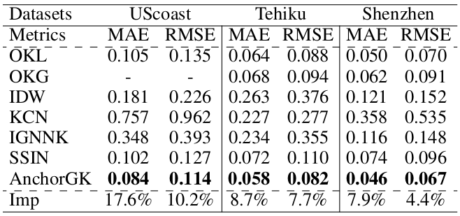

# AnchorGK: Anchor Station-based Graph Learning Framework for Spatio-Temporal Kriging

This repository contains the code and datasets for the paper "AnchorGK: Anchor Station-based Graph Learning Framework for
Spatio-Temporal Kriging". In this paper, we propose a new method for spatio-temporal kriging considering the sparse spatial distribution of stations and the availability of features at different stations.

The overall architecture can be found on the following figure.

  

The main results on spatial kriging task can be found here:

  

