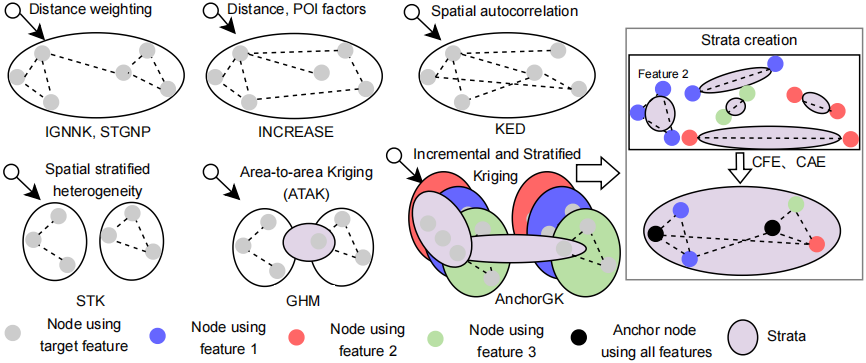
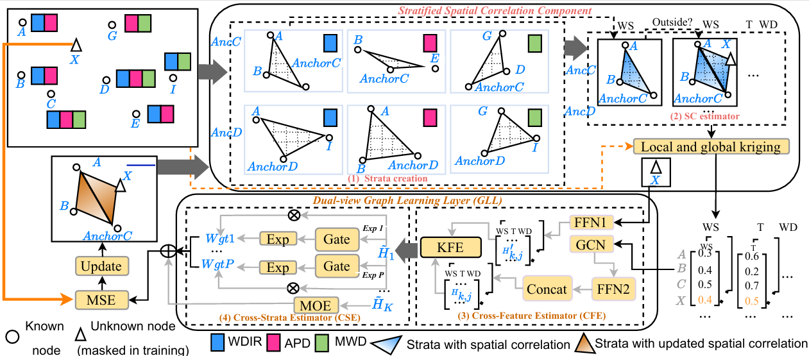
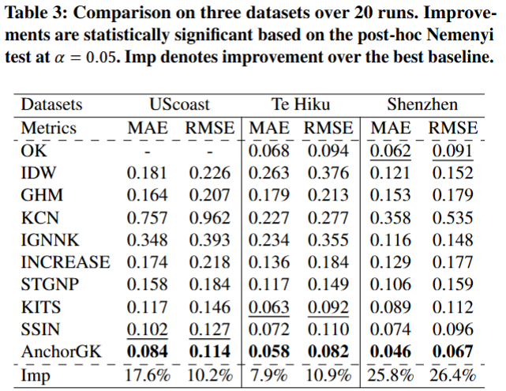
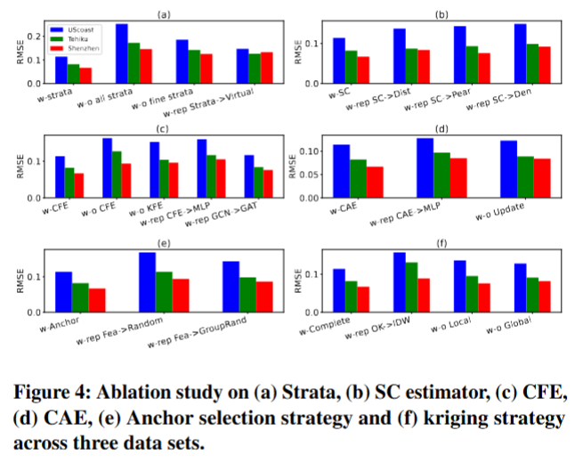
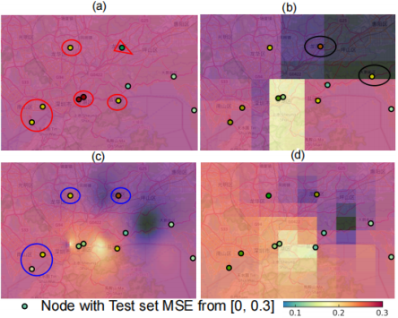
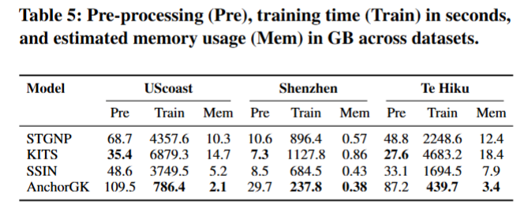

# AnchorGK 

Hi, Welcome to the official repository of the AnchorGK paper:  
**"Anchor-based Incremental and Stratified Graph Learning Framework for Inductive Spatio-Temporal Kriging".** 

## Comparison

**Please note that** [**OK**](https://link.springer.com/book/10.1007/978-3-662-05294-5), [**IDW**](https://www.sciencedirect.com/science/article/abs/pii/S0098300408000721) and [**GHM**](https://www.tandfonline.com/doi/full/10.1080/13658816.2022.2147530?scroll=top&needAccess=true) are statistical approaches.  
Among DL-based approaches, [**KCN**](https://arxiv.org/pdf/2306.09463), [**SSIN**](https://arxiv.org/pdf/2311.15530), [**INCREASE**](https://arxiv.org/abs/2302.02738), [**STGNP**](https://dl.acm.org/doi/pdf/10.1145/3580305.3599372) and [**KITS**](https://arxiv.org/pdf/2311.02565) exhibit limitations in effectively handling incomplete features across stations, accommodating spatially sparse observations, and operating in multivariate contexts.

The detailed comparisons can be found on:

### 🔍 Comparison of Spatial-Temporal Kriging and Graph-Based Models

| **Model** | **Strata**<br>**Aware** | **Inductive** | **Incremental** | **Sparse** | **Incomplete** | **Multi-**<br>**variate** | **Effi-**<br>**ciency** | **Strengths** | **Limitations** |
| :-- | :--: | :--: | :--: | :--: | :--: | :--: | :--: | :-- | :-- |
| [**OK**](https://link.springer.com/book/10.1007/978-3-662-05294-5)<br>(Ordinary Kriging) | ✗ | ✗ | ✗ | ✗ | ✗ | ✗ | Med | Classic baseline | Not scalable; ignores heterogeneity |
| [**IDW**](https://www.sciencedirect.com/science/article/abs/pii/S0098300408000721)<br>(Inverse Distance Weighting) | ✗ | ✗ | ✗ | ✗ | ✗ | ✗ | High | Simple; no training | Ignores spatial correlation |
| [**GHM**](https://www.tandfonline.com/doi/full/10.1080/13658816.2022.2147530?scroll=top&needAccess=true)<br>(Generalised Heterogeneity Model) | ✔ | ✗ | ✗ | ✔ | ✗ | ✗ | Med | Stratified spatial modelling | Non-inductive; fixed graph |
| [**KCN**](https://arxiv.org/pdf/2306.09463) | ✗ | ✗ | ✗ | ✗ | ✗ | ✗ | Med | CNN-based spatial learning | Poor on missing & multi-variate data |
| [**IGNNK**](https://openreview.net/forum?id=jeBic1U1KXz) | ✗ | ✔ | ✗ | ✗ | ✗ | ✗ | High | Inductive kriging via GNN | No strata; no missing data support |
| [**INCREASE**](https://arxiv.org/abs/2302.02738) | ✗ | ✔ | ✗ | ✗ | ✗ | ✗ | Med | Good generalisation | No sparse or multivariate input support |
| [**STGNP**](https://dl.acm.org/doi/pdf/10.1145/3580305.3599372) | ✗ | ✔ | ✗ | ✗ | ✗ | ✔ | Med | Multivariate TS modelling | Poor handling of missing features |
| [**KITS**](https://arxiv.org/pdf/2311.02565) | ✗ | ✔ | ✔ | ✔ | ✗ | ✗ | Low | Handles sparsity; incremental | Biased by pseudo-nodes |
| [**SSIN**](https://arxiv.org/pdf/2311.15530) | ✗ | ✔ | ✗ | ✗ | ✗ | ✗ | Med | Lightweight spatial method | No support for missing or multivariate |
| **AnchorGK**<br>(Proposed) | ✔ | ✔ | ✔ | ✔ | ✔ | ✔ | High | Full support for sparse,<br>incomplete, multivariate data | Scaling to larger graphs TBD |

We also provide the comparison in the following figure:



## Introduction

**AnchorGK** is the advanced successor to [**KITS**](https://arxiv.org/pdf/2311.02565) and [**SSIN**](https://arxiv.org/pdf/2311.15530) in inductive spatio-temporal kriging. While these methods either depend on *dense node-wise correlations* or process features separately, they fail to effectively capture **region-level structures** and **cross-feature dependencies** in scenarios with **spatial sparsity** and **incomplete features**.  

To overcome these limitations, **AnchorGK** introduces an *incremental stratified spatial correlation component* to model **broad region-level spatial semantics** and a *dual-view graph learning layer* to integrate **cross-feature** and **cross-strata information**. This design allows the framework to exploit **diverse spatial** and **feature patterns**, thereby achieving more accurate and robust inference in **sparsely observed regions**.  



To estimate $\mathcal{Y}$, AnchorGK employs two novel components: (1) Stratified Spatial Correlation Component (SSCC), which establishes the fine-grained estimation of spatial correlations between known locations and unknown locations; and (2) Dual-view Graph Learning Layer (GLL), which integrates the information from relevant features and locations for spatio-temporal kriging. Overall, AnchorGK outperforms all baseline models in terms of both RMSE and MAE across all datasets with statistical significance based on the post-hoc Nemenyi test.



The ablation study across three datasets has been conducted to show the effectiveness of Stratified Spatial Correlation Component (SSCC) and Graph learning Layer (GLL) in AnchorGK.



AnchorGK also enhance the kriging performance compared to the SOTA methods in the visualization of kriging performance.



Also, the efficiency can be obtained by AnchorGK from the less training time giving the usage of subgraphs.



## Getting Started

### Toy example

To run AnchorGK with a naive synthetic dataset, executing AnchorGK_syn.ipynb to better understand the architecture.

### Environment Requirements

To get started, ensure you have Conda installed on your system and follow these steps to set up the environment:

```
conda create -n AnchorGK python=3.8
conda activate AnchorGK
pip install -r requirements.txt
```

### Data Preparation

All the datasets needed for AnchorGK can be obtained from the [[Google Drive]](https://drive.google.com/drive/folders/1br5TDSDLRB_lq_lvFhkO5ayxkcOVWsip) that introduced in previous works such as [**DAMR**](https://dl.acm.org/doi/abs/10.1145/3589333) and [**FFA**](https://www.microsoft.com/en-us/research/wp-content/uploads/2016/02/Forecasting20air20qualtiy-kdd2015-camera-ready.pdf). 
Create a separate folder named ```./dataset``` and place all the CSV files in this directory. 
**Note**: Place the CSV files directly into this directory, such as "./dataset/ETTh1.csv"


### Training Scripts

The training scripts for replicating the AnchorGK results are available at:

```
./scripts/AnchorGK
```

### Reproduction of the Main Results

You can reproduce the main results of AnchorGK with the following code.

```
conda create -n AnchorGK python=3.8
conda activate AnchorGK
pip install -r requirements.txt
sh run_main.sh
```

For your convenience, we have provided the **results** of "sh run_main.sh":
```
./result.txt
```

### Reproduction the Baseline Results

You can also reproduce all the baseline models following:
```
sh run_ablation.sh
```
