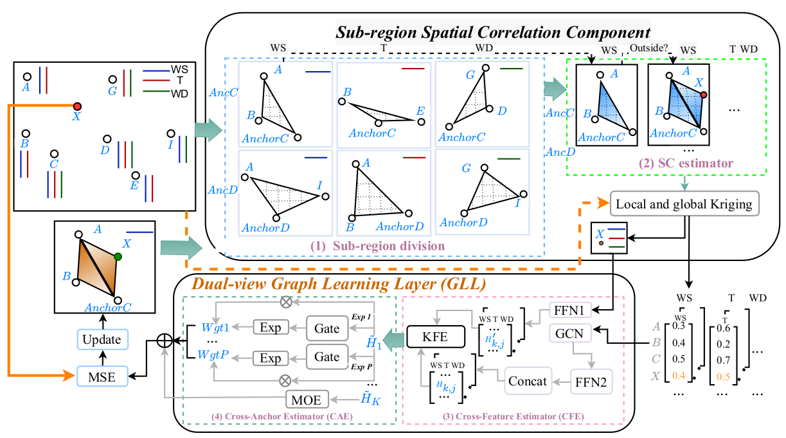

# AnchorGK code 

Hi, Welcome to AnchorGK!

Please see the AnchorGK.ipynb, AnchorGK_NDBC.ipynb, AnchorGK_syn.ipynb for the detailed process of the AnchorGK.

We also provide several variants like NDBC_IDW_GCN_MODE_KING.py, NDBC_IDW_GCN_MOE_KING.py, etc. which are based on several models in the ablation studies.

The datasets are shown in data folder.

Baseline models are shown in the baseline folder. 

AnchorGK architecture can be found on the following figure.

Also, the main results can be found in the following figure.

Enjoy and welcome!
